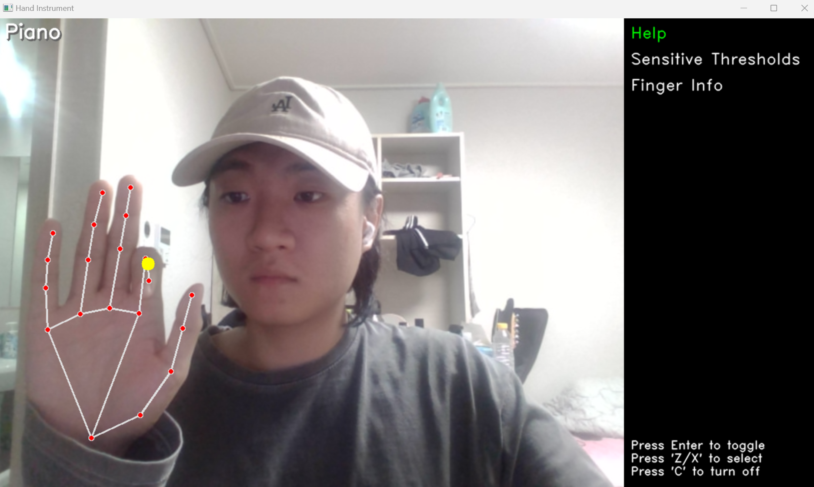
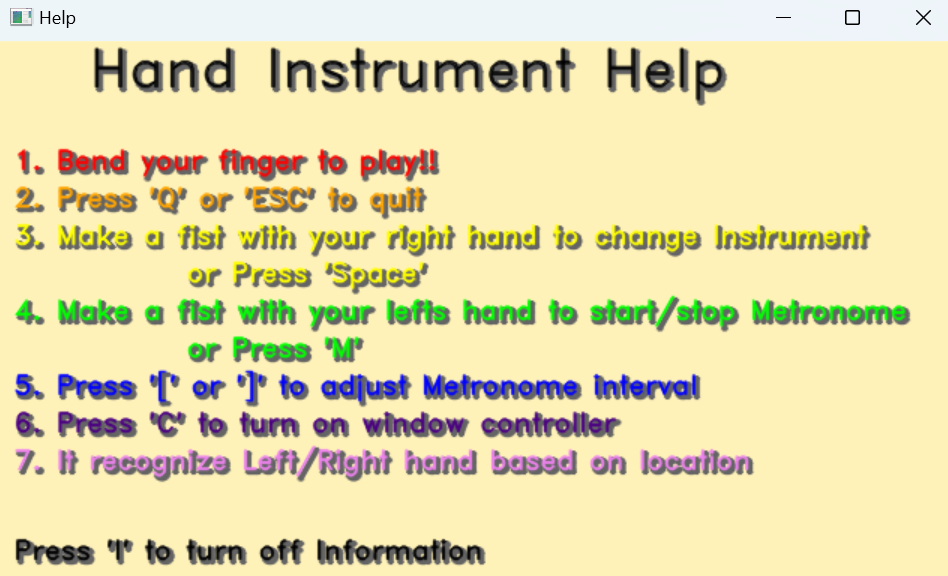
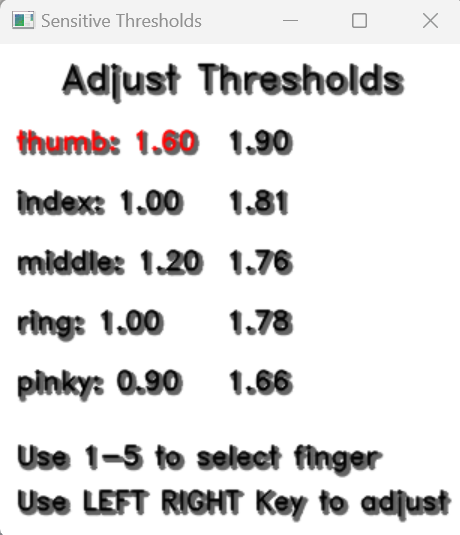
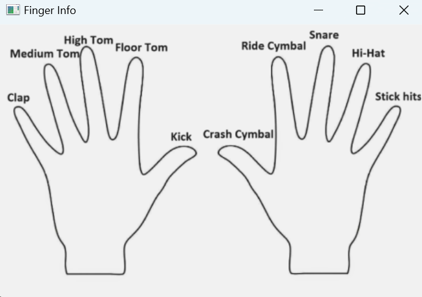

# Hand Instrument Project

This project uses computer vision to create a virtual instrument that can be played using hand gestures detected by a webcam. You can play Piano, Drum and Xylophone


## Features

- **Hand Tracking**: Uses Mediapipe to detect and track hands in real-time.
- **Instrument Sounds**: Plays different instrument sounds (Piano, Drum, Xylophone) using finger
- **Sensitivity Threshold Adjustment**: Allows users to adjust the sensitivity of finger
- **Metronome**: Includes a metronome feature with adjustable intervals.
- **Help**: Provides a help window explaining how to use 
- **Finger Info**: Shows sound of each fingers
- **Control Box**: Allows users to control different windows (Help, sensitivity Thresholds, Finger Info) using a remote control box.

## Installation

1. **Clone the repository**:
    ```sh
    git clone https://github.com/yourusername/hand-instrument.git
    cd hand-instrument
    ```

2. **Install required packages**:
    ```sh
    pip install -r requirements.txt
    ```
    
    The `requirements.txt` file should contain the following dependencies:
    ```plaintext
    mediapipe
    pygame
    opencv-python
    numpy
    ```

## Usage

1. **Run the main script**:
    ```sh
    python main.py
    ```

2. **Controls**:
    1. **KeyBoard**
       - `i`: Toggle the help window.
       - `Space`: Change the instrument.
       - `q` or `ESC`: Quit the application.
       - `1` to `5`: Select thumb, index, middle, ring, or pinky finger respectively for threshold adjustment.
       - `=` and `-`: Increase or decrease the threshold for the selected finger.
       - `m`: Start/Stop the metronome.
       - `[` and `]`: Decrease or increase the metronome interval.
       - `c`: Toggle window control box.
       - `z` and `x`: Navigate through the control box options.
       - `Enter`: Toggle the selected window in the control box.
    <br>

    2. **Hand**
       - `Bend your finger` to play sound
       - `Make fist with Right hand` to change instrument
       - `Make fist with Left hand` to start Metronome

(You can check this on Help window too)

## Window Information

   1. **Main**
      
      - Points of hand appears on the screen
      - Yellow is displayed on the fingers that make a sound.
      - On the right side of the screen, you can control other windows

   2. **Help**
      
       
   3. **Sensitivity Thresholds** 
      
      - On the right side, it shows the finger's current angle value
      - It makes sound when the angle value is lower than the threshold

   4. **Finger Info**
      
      - It shows the finger's current sound


## Program Usage Video
   1. **Piano**

   [](https://www.youtube.com/watch?v=13rA8FfwtO4)

   <br><br>

   2. **Xylophone**

   [](https://www.youtube.com/watch?v=0ibOeEEJzJs)

   <br><br>

   3. **Drum**

   [](https://www.youtube.com/watch?v=iskAuhqkUgg)

   <br><br>

   4. **Change Instrument and Metronome**

   [](https://www.youtube.com/watch?v=0K80JKxfJ8Q)
    

## License

This project is licensed under the MIT License. See the LICENSE file for details.

